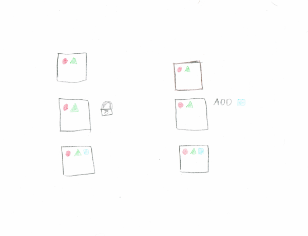
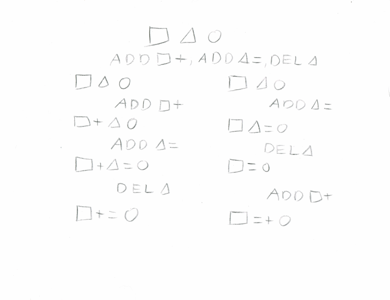
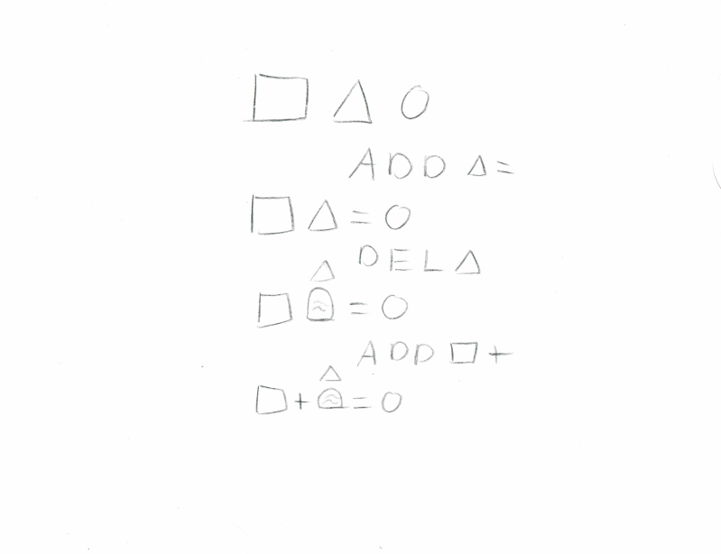

# Escaping the Async Maze

!SLIDE

# Single Page Application MicroServices
## Ever user has the features they want on their machine
## Communicate through websockets

!SLIDE

# Google Wave

### "Wave took 2 years to write and if we rewrote it today, it would take almost as long to write a second time" Joseph Gentle

!SLIDE

# Operational Transform
## Instead of editing document send edits to document

!SLIDE

# Operational Transforms work pretty well
## Allow concurrent edits to a document
## Deletions don't preserve order

!SLIDE

# Deletion causing ambiguous order

!SLIDE

# Deletes remove Information
## Edits referencing removed text have no clear reference point

!SLIDE

# Reverse the Polarity
## Instead of deletes removing information they add a tombstone

!SLIDE

## Tombstones give a reference point for edits

!SLIDE

# Firm basis for concurrent editing
## Only trivial details of speed and efficiency are left

!SLIDE

# Monotonic Join Semi Lattice
## Always increasing - Monotonic
## Smallest Value - Join
## Merging can happen in any order - Semi Lattice

!SLIDE

# Basis for Xi merging async plugins json
## Additionaly uses git like merge and rebase mechanics

### More detail then you ever wanted https://google.github.io/xi-editor/docs/crdt-details.html
