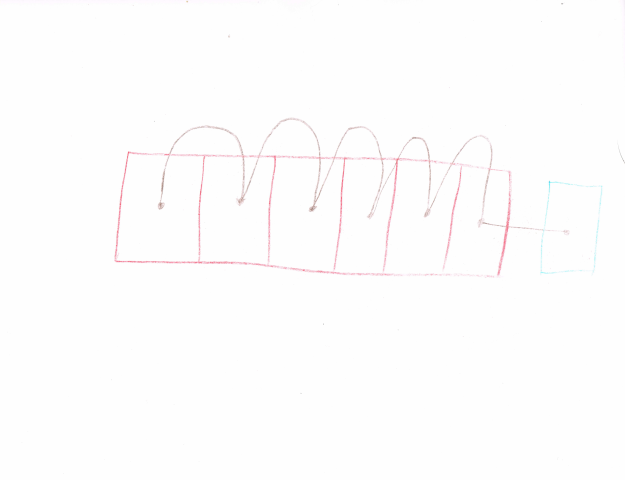
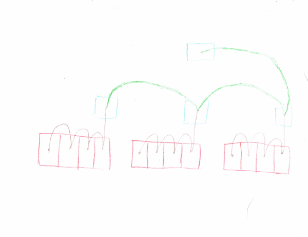
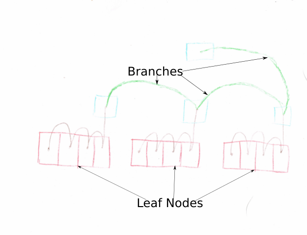
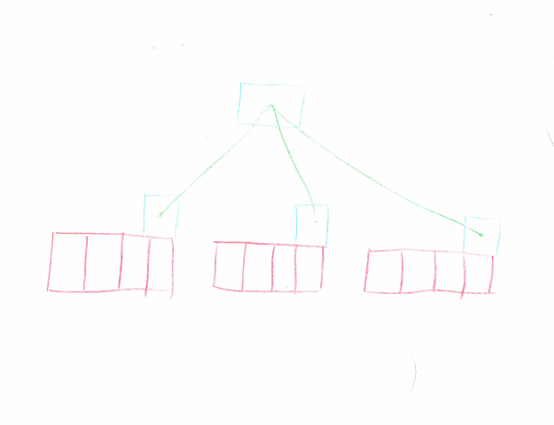

# Parallel Processing Text

!SLIDE

# 16 ms window
## Difficult, large overhead, marginal benefits

!SLIDE

# Map Reduce for text
## Spell to turn sequential stateful processing into parallel functional processing

!SLIDE

# Typical for loop
## Add elements to aggregate
    @@@javascript
    aggregate = 0;
    for(i = 0; i < arr.length; i++) {
      aggregate = add(aggregate, arr[i]);
    }

!SLIDE

# Iterative Accumulation
## Two pieces to turn into map reduce

!SLIDE

# Identity Aggregate
* Sets - Empty Set
* String - Empty String
* Integers - Zero (Addition)

!SLIDE

# Aggregate - Merge operation
* Sets - Union
* String - Concatenation
* Integers - Addition

!SLIDE

# Transformed Operation
    @@@javascript
    //Chunk of a sequence
    aggregate1 = identity();
    for(i = 0; i < chunk.length; i++) {
      aggregate1 = add(aggregate1, arr[i]);
    }
    //Merging
    merge(aggregate1, aggregate2);

!SLIDE

# A simple recipe for processing text in parallel
## We can get line height, line breaks, longest line, even parenthesis matching

!SLIDE

# Incremental Updates
## Transform computation into data structure

!SLIDE

# Map Reduce is very tree like
## Mapping Jobs - Leaf Nodes
## Aggregates - Node Metadata

!SLIDE

# Rope
## Made from many strings

!SLIDE

# Monoid Homomorphism
## Same Structure when aggregating - Homomorphism
## Merge Function and identity - Monoid

!SLIDE

# Incremental update

!SLIDE

# Persistent and Immutable
## Easy to snapshot and branch
